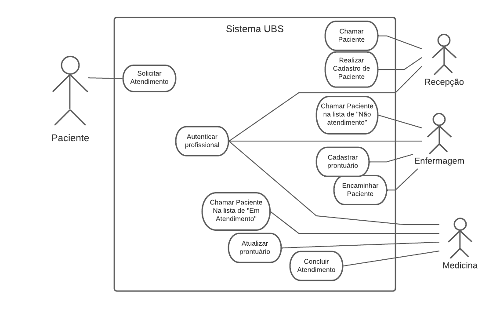

# :stethoscope: Sistema Web Simple para uma UBS :computer:

 Simple UBS Web System: Project been made aiming to apply agile methods, requirements engineering and others subjects related to the course of Projects and Software Engineering of my Computer Engineed Degree taught at the Universidade Federal do Rio Grande do Norte.

 Sistema UBS Web Simples: Projeto realizado visando a aplicação de métodos ágeis, engenharia de requisitos e outras disciplinas relacionadas ao curso de Projetos e Engenharia de Software do curso de Engenharia de Computação da Universidade Federal do Rio Grande do Norte.

## Requisitos

### :dart: First Use Case Diagram

#### :pencil: Descrição dos Casos de Uso
---
> Paciente :raising_hand:

***Solicitar atendimento***  
***Ator:*** *Paciente*  
***Fluxo normal***:  
*1 - Paciente inicia nova solicitação de atendimento ao chegar na UBS, via painel central.*  
*2 - Sistema pergunta ao paciente qual área relacionada com sua queixa.*  
*3 - Sistema pergunta qual tipo de preferência de atendimento do paciente.*  
*4 - Paciente efetua conclusão da solicitação.*  
*5 - Sistema informa ao paciente uma senha de solicitação*  
*6 - Sistema notifica recepção de sobre uma nova solicitação de atendimento.*  

---
> Recepção :technologist:

***Chamar Paciente***  
**Pré-Condição:** *Autentica Profissional*
***Ator:*** *Recepção*  
***Fluxo normal:***  
*1 - Sistema informa fila de solicitações a recepção* 
*2 - Recepção seleciona solicitação* 
*3 - Sistema informa solicitação selecionada aos pacientes* 
*4 - Sistema pergunta Recepção se paciente veio* 
*5 - Sistema exclui solicitação* 
***Extensões:*** 
*4a - Se paciente vier, sistema segue para cadastro* 

***Realizar Cadastro de Paciente** 
**Pré-Condição:** *Autentica Profissional*
**Ator:** Recepção 
**Fluxo normal:** 
1 - Chamar paciente (Sublinhado)  
2 - Recepção informa nome do paciente e CPF ao sistema 
3 - Sistema verifica se paciente está na lista de atendidos 
4 - Sistema deve efetuar novo cadastro ou editar existente 
5 - Recepção informa dados do paciente ao sistema (Data de Nascimento, Logradouro, Telefone, Email) 
6 - Recepção conclui cadastramento. 
7 - Sistema move paciente para lista de não atendidos (Atualiza Status). 
8 - Sistema notifica Enfermagem sobre novo paciente.* 

---
> Enfermagem :health_worker:

***Chamar Paciente na lista de Não Atendidos** 
**Pré-Condição:** *Autentica Profissional*
**Ator:** Enfermagem 
**Fluxo normal:** 
1 - Sistema Informa Lista de pacientes Não atendidos 
2 - Enfermagem seleciona paciente 
3 - Sistema informa paciente selecionada aos pacientes 
**Extensões:** 
3a - Sistema deve chamar paciente por nome* 

***Cadastrar prontuário** 
**Pré-Condição:** *Autentica Profissional*
**Ator:** Enfermagem 
**Fluxo normal:** 
1 - Chamar Paciente na lista de Não Atendidos 
2 - Sistema pergunta a Enfermagem se paciente veio 
3 - Enfermagem abre novo prontuário para paciente 
4 - Enfermagem realiza Triagem (Anamnese, Classificação das cores etc.) 
5 - Enfermagem conclui Triagem. 
6 - Sistema conclui cadastramento de novo prontuário 
**Extensões:** 
1a - Se paciente não vier sistema move para lista de “Atendidos” (atualiza status) 
2a - Novo prontuário deve ter característica única do dia* 

***Encaminhar Paciente** 
**Pré-Condição:** *Autentica Profissional*
**Ator:** Enfermagem 
**Fluxo normal:** 
1 - Cadastrar Prontuário 
2 - Sistema pergunta enfermagem setor de atendimento do paciente 
3 - Sistema encaminha paciente para lista de pacientes “Em atendimento” (atualiza status) 
4 - Sistema notificar medicina sobre novo paciente “Em atendimento”* 

---
> Medicina :medical_symbol:

***Chamar paciente na Lista de “Em atendimento”** 
**Pré-Condição:** *Autentica Profissional*
**Ator:** Medicina 
**Fluxo normal:** 
1 - O médico acessa o sistema e seleciona a lista de pacientes que aguardam atendimento. 
2 - O médico identifica o próximo paciente na lista de espera e chama-o pelo nome ou número de cadastro. 
3- O paciente se apresenta ao médico para receber o atendimento necessário. 
**Extensões:** 
1a - Caso o paciente não esteja presente no momento em que é chamado, o médico pode marcar a ausência no sistema e chamar o próximo paciente da lista 
3a - Se houver algum imprevisto que impeça o atendimento imediato do paciente (por exemplo, a necessidade de realizar algum procedimento antes), o médico pode registrar essa informação no sistema e informar ao paciente o tempo estimado de espera.*

***Atualizar Prontuário** 
**Pré-Condição:** *Autentica Profissional*
**Ator:** Medicina 
**Fluxo normal:** 
1 - O médico acessa o sistema e busca pelo prontuário do paciente que deseja atualizar. 
2 - O médico seleciona a opção "Atualizar prontuário" e insere as informações relevantes, tais como sintomas, diagnósticos, tratamentos prescritos e resultados de exames. 
3 -O médico salva as informações atualizadas no sistema. 
***Extensões:*** 
1a - Caso o médico identifique algum problema no prontuário (por exemplo, informações incorretas ou incompletas), ele pode solicitar uma revisão do prontuário ou a correção dos dados necessários.*

****Concluir atendimento*** 
**Pré-Condição:** *Autentica Profissional*
**Ator:** Medicina 
**Fluxo normal:** 
1 - O médico acessa o sistema e verifica se todas as informações relevantes foram devidamente registradas no prontuário do paciente. 
2 - O médico finaliza o atendimento selecionando a opção "Concluir atendimento" no sistema. 
3 - O sistema atualiza o status do paciente para "Atendimento concluído". 
**Extensões:** 
1a - Caso o médico identifique a necessidade de prescrever medicamentos ao paciente, ele pode selecionar a opção "Prescrever medicamentos" e inserir as informações correspondentes.*

---
> Todos

***Autenticar Profissional** 
**Ator:** Recepção, Enfermagem e Medicina 
**Fluxo normal:** 
1 - Sistema verifica se existe Token de autenticação para profissional 
2 - Sistema solicita nome de usuário 
3 - Sistema solicita senha 
4 - Sistema retorna feedback de autenticação 
**Extensões:** 
4a - Se usuário ou senha estiverem incorretos, sistema indica erro e solicita novamente*

## :bookmark_tabs: References

- [Engenharia de Software Moderna - Marco Tulio Valente](https://engsoftmoderna.info/)
- [Prof. Eduardo Falcão - Github](https://github.com/eduardolfalcao)

